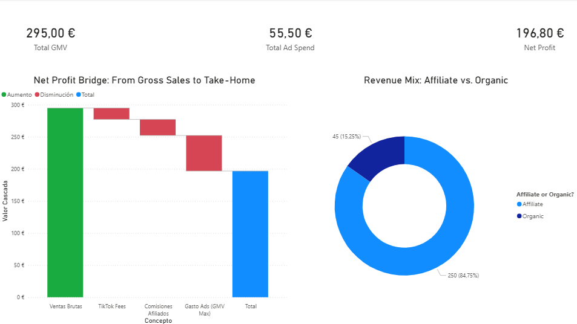

# TikTok Shop : Automated Financial Bridge & Analytics

This project is a full-stack data engineering and business intelligence solution designed to integrate **TikTok Shop** operations with **Shopify** logistics. It automates the ingestion of raw order data, performs complex financial reconciliation, and delivers executive-level insights into profitability.

## Project Overview
E-commerce brands operating on TikTok Shop often struggle with "hidden" costs (platform fees, influencer commissions, and marketing spend) that make calculating true net profit difficult. This system provides a "single source of truth" by integrating:

* **PostgreSQL Database:** A structured relational schema for data persistence and SKU mapping.
* **Python Middleware:** A logic engine that handles financial calculations and protects sensitive credentials.
* **Power BI Intelligence:** A dynamic dashboard that visualizes the "Profit Bridge" and sales attribution.

## Business Intelligence & KPIs
The Power BI dashboard focuses on three critical levels of business health:

* **Executive Metrics:** Real-time tracking of Gross Merchandise Value (GMV), total marketing investment, and final Net Profit.
* **The Net Profit Bridge:** A waterfall visualization mapping exactly how revenue moves from "Gross Sales" to "Take-Home" after deducting platform fees (6%), affiliate payouts, and ad costs.
* **Revenue Attribution:** A channel mix analysis identifying the percentage of sales driven by the Affiliate program versus Organic brand reach.
  


## Technical Implementation

### Database Architecture (`schema.sql`)
The relational model ensures data integrity across the supply chain:
* **orders_integration**: Stores financial breakdowns and synchronization statuses.
* **sku_mapping**: Translates TikTok-specific SKUs into Shopify-ready identifiers.
* **ad_spend**: Tracks daily marketing costs (GMV Max) to calculate true ROI.

### Logic Engine (`bridge.py`)
The Python middleware automates the financial integration:
* **Automatic Fee Calculation**: Applies platform fee structures and calculates affiliate commissions per order.
* **Credential Security**: Utilizes a modular configuration system (`config.py`) to keep database secrets outside of version control.
* **Integrity Management**: Includes robust transaction handling to prevent duplicate entries and ensure data accuracy.

## Project Structure

```bash
├── bridge.py           # Core integration and financial logic
├── config.py           # (Local only) Database credentials
├── schema.sql          # PostgreSQL database definitions
├── .gitignore          # Security rules for version control
└── tiktok_shopify.png  # Dashboard created with Power BI
```

---
